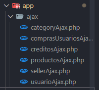
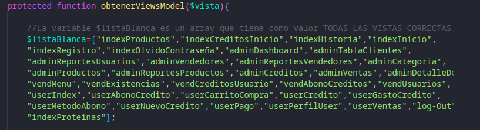
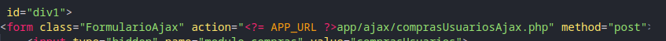

# Manual de mejoras

#### Se explicara de forma simplificada como se aplican las multiples tecnologias

- Ajax
- Enrutador
- PDO
- Config

## Ajax

Ajax funciona dentro de los formularios, en lugar de cambiarlos por completo,
añade algunas propiedades, como lo son la clase y un manejo por modulos

La sintax de un formulario ajax se escribe de la siguiente manera:

```html
<form class="FormularioAjax" action="" method="post">
  <input type="hidden" name="modulo_usuario" value="registrar" />
</form>
```

se añade la clase "FormularioAjax" para especificarle que la informacion que
esta dentro del formulario se enviara a la clase formulario, esa clase esta
dentro del archivo "ajax.js" en la carpeta js, en esa carpeta se maneja una
estructura de manejo de datos recibidos de formularios y alertas para
personalizar...

### Envio de datos de los formularios

Una vez recibido, ajax puede mandar los datos que tiene a otros archivos, los
archivos para enrutar a que archivo deben de ir los datos, es en la carpeta ajax
que esta en app



La estructura que manejan los archivos son por modulos, cuando es un modulo
usuario, se crea un **input hidden** para especificar que el input no se vera, y
solo servira para mandar datos ya definidos anteriormente, su sintax es:

```html
<input type="hidden" name="modulo_usuario" value="registrar" />
```

En donde en _**name**_ se usa para especificar el modulo, y el _**value**_ para
especificar que hara

```php
if(isset($_POST["modulo_usuario"])){

    $insUsuario = new userController();

    if($_POST['modulo_usuario'] == "registrar"){

        echo $insUsuario->registrarUsuarioControlador();
    }

```

## Enrutador
El enrutador es un componente en *PHP* el cual se encarga de recibir peticiones del
navegador web (*_URLS_*) con el fin de mejorar la organizacion y manejo de archivos
llevando asi al usuario a la parte correcta del codigo que solicita, esto
permite que a la hora de desarrollar software sea mucho mas facil identificar
las rutas, puesto que maneja una url especifica para *TODO* el proyecto

Por lo general, el enrutador maneja una sintax unica para especificar la URL,
dicha sintax es:

```php
<?= APP_URL ?>
```

El *APP_URL* es realmente una ruta por defecto, quiere decir que su contenido es
el mismo en donde quieras aplicarlo, dicho contenido es:

```html
http://localhost/EDM/EDM/userCarritoCompra/
```
el cual hace que a la hora de interactuar con un archivo, no se muestren las carpetas
en las que estan todos los archivos, solo mostrara la carpeta principal en el url,
y con el enrutador, mostrara el archivo sin necesidad de mostrar su carpeta exacta,
quitando asi tambien su extension *.php* 

El enrutador se configura en **config/app.php**

### Requisitos

Para añadir un archivo que el enrutador detecte, tiene que cumplir con dos requisitos previos
los cuales son:

- Nombre del archivo
- Nombre incluido en la lista

### Nombre del archivo
a la hora de crear un nuevo archivo, el archivo si o si debe de tener al final de su nombre

```html
nombreDelArchivo-view.php
```
el ***-view*** lo que hace es especificarle al enrutador que es una vista que debe mostrarse

### Lista blanca
Cuando ya el archivo tiene un nombre apto para mostrar, se debe de incluir el nombre
del archivo **SIN EL -VIEW** en una lista en php.

Dicha lista es un array que maneja todos los archivos que se deben de mostrar al usuario
y por ende, estan en un array para especificar que archivos si se mostraran.

Esta lista se encuentra en:
```html
app/model/viewsModel.php
```
Asi luce dicha lista:



Al añadir el nombre del archivo, debe ser sin **_-VIEW_** y debe de ser al final del array.

#### Formularios

En los formularios se hace uso de tanto *AJAX* como del *ENRUTADOR*

En los action se usara un enrutador que especificara a que archivo deben de ir,
el cual sera a la carpeta *AJAX* y a la carpeta a la que necesites mandar los datos.


